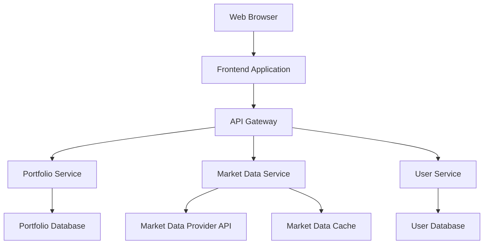

# Design Document

## Overview

The Fintech Portfolio Dashboard is a web-based application that provides users with comprehensive portfolio management capabilities, real-time market data integration, and performance analytics. The system will be built as a modern single-page application with a responsive design optimized for both desktop and mobile devices.

## Architecture

### High-Level Architecture



### Technology Stack

**Frontend:**
- React.js with TypeScript for type safety
- Material-UI or Tailwind CSS for responsive design
- Chart.js or Recharts for data visualization
- React Query for state management and caching

**Backend:**
- Node.js with Express.js framework
- TypeScript for consistent typing across the stack
- JWT for authentication and authorization
- Rate limiting middleware for API protection

**Database:**
- PostgreSQL for relational data (users, portfolios, positions)
- Redis for caching market data and session management

**External Services:**
- Market data provider (Alpha Vantage, IEX Cloud, or Polygon.io)
- WebSocket connection for real-time price updates

## Components and Interfaces

### Frontend Components

#### Dashboard Component
- **Purpose**: Main landing page displaying portfolio overview
- **Props**: User portfolio data, market status
- **State**: Loading states, error handling
- **Features**: Portfolio summary cards, quick actions, market status indicator

#### Portfolio Manager Component
- **Purpose**: Detailed portfolio view with position management
- **Props**: Portfolio positions, market data
- **State**: Edit mode, form validation
- **Features**: Add/edit/remove positions, bulk operations

#### Stock Search Component
- **Purpose**: Search and select stocks for portfolio or watchlist
- **Props**: Search callback, validation rules
- **State**: Search results, loading state
- **Features**: Autocomplete, symbol validation, company information display

#### Watchlist Component
- **Purpose**: Monitor stocks without owning them
- **Props**: Watchlist data, market prices
- **State**: Sort preferences, display options
- **Features**: Add/remove stocks, price alerts, quick add to portfolio

#### Charts Component
- **Purpose**: Display historical performance and analytics
- **Props**: Time series data, chart configuration
- **State**: Time range selection, chart type
- **Features**: Interactive charts, zoom functionality, comparison tools

### Backend API Interfaces

#### Portfolio API
```typescript
interface PortfolioAPI {
  GET /api/portfolio/:userId - Get user's complete portfolio
  POST /api/portfolio/position - Add new stock position
  PUT /api/portfolio/position/:id - Update existing position
  DELETE /api/portfolio/position/:id - Remove position
  GET /api/portfolio/performance/:userId - Get performance metrics
}
```

#### Market Data API
```typescript
interface MarketDataAPI {
  GET /api/market/quote/:symbol - Get current stock quote
  GET /api/market/quotes - Get multiple quotes (batch)
  GET /api/market/search/:query - Search for stocks
  GET /api/market/history/:symbol - Get historical price data
  WebSocket /ws/market - Real-time price updates
}
```

#### Watchlist API
```typescript
interface WatchlistAPI {
  GET /api/watchlist/:userId - Get user's watchlist
  POST /api/watchlist - Add stock to watchlist
  DELETE /api/watchlist/:userId/:symbol - Remove from watchlist
}
```

## Data Models

### User Model
```typescript
interface User {
  id: string;
  email: string;
  firstName: string;
  lastName: string;
  createdAt: Date;
  updatedAt: Date;
  preferences: UserPreferences;
}

interface UserPreferences {
  currency: string;
  timezone: string;
  dashboardLayout: string[];
}
```

### Portfolio Model
```typescript
interface Portfolio {
  id: string;
  userId: string;
  name: string;
  positions: StockPosition[];
  totalValue: number;
  totalGainLoss: number;
  totalGainLossPercent: number;
  createdAt: Date;
  updatedAt: Date;
}

interface StockPosition {
  id: string;
  portfolioId: string;
  symbol: string;
  companyName: string;
  quantity: number;
  averageCost: number;
  currentPrice: number;
  marketValue: number;
  gainLoss: number;
  gainLossPercent: number;
  purchaseDate: Date;
  lastUpdated: Date;
}
```

### Market Data Model
```typescript
interface StockQuote {
  symbol: string;
  companyName: string;
  currentPrice: number;
  previousClose: number;
  change: number;
  changePercent: number;
  volume: number;
  marketCap: number;
  timestamp: Date;
  marketStatus: 'OPEN' | 'CLOSED' | 'PRE_MARKET' | 'AFTER_HOURS';
}

interface HistoricalData {
  symbol: string;
  data: PricePoint[];
}

interface PricePoint {
  date: Date;
  open: number;
  high: number;
  low: number;
  close: number;
  volume: number;
}
```

### Watchlist Model
```typescript
interface Watchlist {
  id: string;
  userId: string;
  stocks: WatchlistItem[];
  createdAt: Date;
  updatedAt: Date;
}

interface WatchlistItem {
  symbol: string;
  companyName: string;
  addedAt: Date;
  alertPrice?: number;
}
```

## Error Handling

### Frontend Error Handling
- **Network Errors**: Display user-friendly messages with retry options
- **Validation Errors**: Real-time form validation with clear error messages
- **Market Data Errors**: Graceful degradation when live data is unavailable
- **Authentication Errors**: Automatic redirect to login with session restoration

### Backend Error Handling
- **API Rate Limiting**: Implement exponential backoff for external API calls
- **Database Errors**: Transaction rollback and error logging
- **Market Data Provider Errors**: Fallback to cached data with staleness indicators
- **Input Validation**: Comprehensive validation with detailed error responses

### Error Response Format
```typescript
interface ErrorResponse {
  error: {
    code: string;
    message: string;
    details?: any;
    timestamp: Date;
  };
}
```

## Testing Strategy

### Frontend Testing
- **Unit Tests**: Component logic, utility functions, data transformations
- **Integration Tests**: API integration, user workflows, form submissions
- **E2E Tests**: Critical user journeys (login, add position, view dashboard)
- **Visual Regression Tests**: UI consistency across different screen sizes

### Backend Testing
- **Unit Tests**: Business logic, data validation, calculations
- **Integration Tests**: Database operations, external API integration
- **Load Tests**: API performance under concurrent user load
- **Security Tests**: Authentication, authorization, input sanitization

### Test Data Management
- **Mock Market Data**: Consistent test data for development and testing
- **User Test Accounts**: Pre-configured accounts with sample portfolios
- **Database Seeding**: Automated test data setup and teardown

## Security Considerations

### Authentication & Authorization
- JWT tokens with short expiration times
- Refresh token rotation
- Role-based access control
- Rate limiting per user and IP

### Data Protection
- HTTPS enforcement
- Input sanitization and validation
- SQL injection prevention
- XSS protection headers

### API Security
- API key management for external services
- Request signing for sensitive operations
- Audit logging for all portfolio changes
- Data encryption at rest and in transit

## Performance Optimization

### Frontend Performance
- Code splitting and lazy loading
- Image optimization and CDN usage
- Memoization of expensive calculations
- Virtual scrolling for large datasets

### Backend Performance
- Database query optimization and indexing
- Caching strategy for market data
- Connection pooling
- Background job processing for heavy operations

### Real-time Updates
- WebSocket connection management
- Efficient data diffing for updates
- Client-side caching with invalidation
- Graceful fallback to polling if WebSocket fails