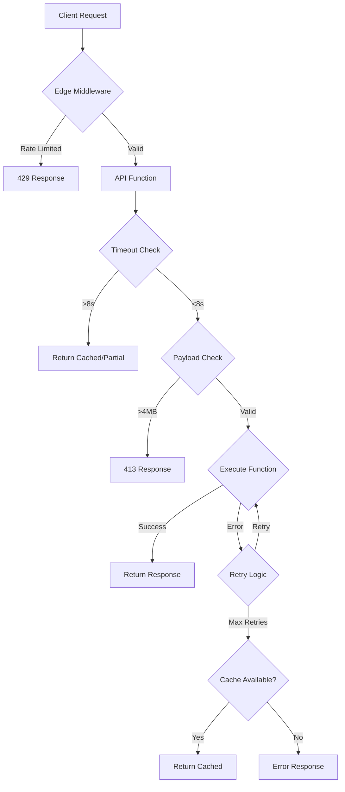

# Design Document: Vercel Error Handling System

## Overview

This design implements a comprehensive error handling and prevention system for the Fintech Portfolio Dashboard deployed on Vercel. The system addresses function timeouts, payload limits, invocation failures, routing errors, and external API issues through a layered approach combining middleware, utility functions, caching strategies, and monitoring.

## Architecture

### High-Level Architecture

```
┌─────────────────────────────────────────────────────────────┐
│                     Vercel Edge Network                      │
├─────────────────────────────────────────────────────────────┤
│  Edge Middleware (Lightweight Auth, Rate Limiting)          │
└─────────────────────┬───────────────────────────────────────┘
                      │
┌─────────────────────▼───────────────────────────────────────┐
│              Error Handling Layer                            │
│  ┌──────────────┐  ┌──────────────┐  ┌──────────────┐      │
│  │   Timeout    │  │   Payload    │  │   Retry      │      │
│  │   Handler    │  │   Validator  │  │   Logic      │      │
│  └──────────────┘  └──────────────┘  └──────────────┘      │
└─────────────────────┬───────────────────────────────────────┘
                      │
┌─────────────────────▼───────────────────────────────────────┐
│                 API Functions Layer                          │
│  ┌──────────────┐  ┌──────────────┐  ┌──────────────┐      │
│  │  Portfolio   │  │   Market     │  │  Watchlist   │      │
│  │  Endpoints   │  │   Data API   │  │  Endpoints   │      │
│  └──────────────┘  └──────────────┘  └──────────────┘      │
└─────────────────────┬───────────────────────────────────────┘
                      │
┌─────────────────────▼───────────────────────────────────────┐
│              External Services Layer                         │
│  ┌──────────────┐  ┌──────────────┐  ┌──────────────┐      │
│  │   Circuit    │  │    Redis     │  │  Market Data │      │
│  │   Breaker    │  │    Cache     │  │   Provider   │      │
│  └──────────────┘  └──────────────┘  └──────────────┘      │
└─────────────────────────────────────────────────────────────┘
```

### Error Handling Flow



## Components and Interfaces

### 1. Timeout Handler

**Purpose**: Prevent function timeout errors (504) by enforcing execution time limits.

**Implementation**:
```typescript
// backend/src/middleware/timeoutHandler.ts
interface TimeoutConfig {
  maxExecutionTime: number; // milliseconds
  warningThreshold: number; // milliseconds
}

class TimeoutHandler {
  private startTime: number;
  private config: TimeoutConfig;
  
  constructor(config: TimeoutConfig) {
    this.config = config;
    this.startTime = Date.now();
  }
  
  checkTimeout(): boolean {
    const elapsed = Date.now() - this.startTime;
    return elapsed > this.config.maxExecutionTime;
  }
  
  getRemainingTime(): number {
    const elapsed = Date.now() - this.startTime;
    return Math.max(0, this.config.maxExecutionTime - elapsed);
  }
  
  wrapWithTimeout<T>(
    fn: () => Promise<T>,
    fallback: () => T
  ): Promise<T> {
    return Promise.race([
      fn(),
      new Promise<T>((_, reject) =>
        setTimeout(() => reject(new Error('Timeout')), this.getRemainingTime())
      )
    ]).catch(() => fallback());
  }
}
```

### 2. Payload Validator

**Purpose**: Prevent payload size errors (413, 500) by validating and limiting data size.

**Implementation**:
```typescript
// backend/src/middleware/payloadValidator.ts
interface PayloadLimits {
  maxRequestSize: number; // bytes
  maxResponseSize: number; // bytes
  maxArrayLength: number;
}

class PayloadValidator {
  private limits: PayloadLimits;
  
  validateRequest(req: Request): ValidationResult {
    const contentLength = parseInt(req.headers.get('content-length') || '0');
    
    if (contentLength > this.limits.maxRequestSize) {
      return {
        valid: false,
        error: 'Request payload too large',
        maxSize: this.limits.maxRequestSize
      };
    }
    
    return { valid: true };
  }
  
  paginateResponse<T>(data: T[], page: number, limit: number) {
    const maxLimit = Math.min(limit, this.limits.maxArrayLength);
    const start = page * maxLimit;
    const end = start + maxLimit;
    
    return {
      data: data.slice(start, end),
      pagination: {
        page,
        limit: maxLimit,
        total: data.length,
        hasMore: end < data.length
      }
    };
  }
  
  compressIfNeeded(data: any): { data: any; compressed: boolean } {
    const size = JSON.stringify(data).length;
    
    if (size > this.limits.maxResponseSize * 0.8) {
      // Return compressed or paginated data
      return { data: this.compress(data), compressed: true };
    }
    
    return { data, compressed: false };
  }
}
```

### 3. Circuit Breaker

**Purpose**: Prevent cascading failures from external API issues.

**Implementation**:
```typescript
// backend/src/utils/circuitBreaker.ts
enum CircuitState {
  CLOSED = 'CLOSED',
  OPEN = 'OPEN',
  HALF_OPEN = 'HALF_OPEN'
}

interface CircuitBreakerConfig {
  failureThreshold: number;
  resetTimeout: number; // milliseconds
  monitoringPeriod: number; // milliseconds
}

class CircuitBreaker {
  private state: CircuitState = CircuitState.CLOSED;
  private failureCount: number = 0;
  private lastFailureTime: number = 0;
  private config: CircuitBreakerConfig;
  
  async execute<T>(
    fn: () => Promise<T>,
    fallback: () => T
  ): Promise<T> {
    if (this.state === CircuitState.OPEN) {
      if (this.shouldAttemptReset()) {
        this.state = CircuitState.HALF_OPEN;
      } else {
        return fallback();
      }
    }
    
    try {
      const result = await fn();
      this.onSuccess();
      return result;
    } catch (error) {
      this.onFailure();
      return fallback();
    }
  }
  
  private onSuccess(): void {
    this.failureCount = 0;
    this.state = CircuitState.CLOSED;
  }
  
  private onFailure(): void {
    this.failureCount++;
    this.lastFailureTime = Date.now();
    
    if (this.failureCount >= this.config.failureThreshold) {
      this.state = CircuitState.OPEN;
    }
  }
  
  private shouldAttemptReset(): boolean {
    return Date.now() - this.lastFailureTime > this.config.resetTimeout;
  }
}
```

### 4. Rate Limiter (Edge Compatible)

**Purpose**: Prevent function throttling (503) by limiting request rates.

**Implementation**:
```typescript
// backend/src/middleware/rateLimiter.ts
interface RateLimitConfig {
  windowMs: number;
  maxRequests: number;
  keyGenerator: (req: Request) => string;
}

class RateLimiter {
  private config: RateLimitConfig;
  private redis: RedisClient;
  
  async checkLimit(req: Request): Promise<RateLimitResult> {
    const key = this.config.keyGenerator(req);
    const current = await this.redis.incr(key);
    
    if (current === 1) {
      await this.redis.expire(key, this.config.windowMs / 1000);
    }
    
    const remaining = Math.max(0, this.config.maxRequests - current);
    
    return {
      allowed: current <= this.config.maxRequests,
      remaining,
      resetTime: Date.now() + this.config.windowMs
    };
  }
}
```

### 5. Retry Handler

**Purpose**: Handle transient function invocation failures with exponential backoff.

**Implementation**:
```typescript
// backend/src/utils/retryHandler.ts
interface RetryConfig {
  maxAttempts: number;
  initialDelay: number;
  maxDelay: number;
  backoffMultiplier: number;
}

class RetryHandler {
  private config: RetryConfig;
  
  async executeWithRetry<T>(
    fn: () => Promise<T>,
    shouldRetry: (error: any) => boolean = () => true
  ): Promise<T> {
    let lastError: any;
    
    for (let attempt = 0; attempt < this.config.maxAttempts; attempt++) {
      try {
        return await fn();
      } catch (error) {
        lastError = error;
        
        if (!shouldRetry(error) || attempt === this.config.maxAttempts - 1) {
          throw error;
        }
        
        const delay = this.calculateDelay(attempt);
        await this.sleep(delay);
      }
    }
    
    throw lastError;
  }
  
  private calculateDelay(attempt: number): number {
    const delay = this.config.initialDelay * 
                  Math.pow(this.config.backoffMultiplier, attempt);
    return Math.min(delay, this.config.maxDelay);
  }
  
  private sleep(ms: number): Promise<void> {
    return new Promise(resolve => setTimeout(resolve, ms));
  }
}
```

### 6. Cache Manager

**Purpose**: Implement caching strategies to reduce function invocations.

**Implementation**:
```typescript
// backend/src/utils/cacheManager.ts
interface CacheConfig {
  ttl: number; // seconds
  staleWhileRevalidate: number; // seconds
}

class CacheManager {
  private redis: RedisClient;
  
  async get<T>(
    key: string,
    fetchFn: () => Promise<T>,
    config: CacheConfig
  ): Promise<T> {
    const cached = await this.redis.get(key);
    
    if (cached) {
      const { data, timestamp } = JSON.parse(cached);
      const age = Date.now() - timestamp;
      
      // Fresh data
      if (age < config.ttl * 1000) {
        return data;
      }
      
      // Stale but acceptable
      if (age < (config.ttl + config.staleWhileRevalidate) * 1000) {
        // Revalidate in background
        this.revalidate(key, fetchFn, config);
        return data;
      }
    }
    
    // Fetch fresh data
    return this.fetchAndCache(key, fetchFn, config);
  }
  
  private async fetchAndCache<T>(
    key: string,
    fetchFn: () => Promise<T>,
    config: CacheConfig
  ): Promise<T> {
    const data = await fetchFn();
    const cacheData = {
      data,
      timestamp: Date.now()
    };
    
    await this.redis.setex(
      key,
      config.ttl + config.staleWhileRevalidate,
      JSON.stringify(cacheData)
    );
    
    return data;
  }
  
  private async revalidate<T>(
    key: string,
    fetchFn: () => Promise<T>,
    config: CacheConfig
  ): Promise<void> {
    // Non-blocking background update
    this.fetchAndCache(key, fetchFn, config).catch(console.error);
  }
}
```

### 7. Error Response Handler

**Purpose**: Standardize error responses across all endpoints.

**Implementation**:
```typescript
// backend/src/utils/errorHandler.ts
interface ErrorResponse {
  error: {
    code: string;
    message: string;
    timestamp: string;
    requestId?: string;
    details?: any;
  };
}

class ErrorHandler {
  static handle(error: any, req: Request): Response {
    const errorResponse = this.buildErrorResponse(error, req);
    const statusCode = this.getStatusCode(error);
    
    // Log error
    this.logError(error, req, errorResponse);
    
    return new Response(JSON.stringify(errorResponse), {
      status: statusCode,
      headers: {
        'Content-Type': 'application/json',
        'X-Request-ID': errorResponse.error.requestId || ''
      }
    });
  }
  
  private static buildErrorResponse(error: any, req: Request): ErrorResponse {
    return {
      error: {
        code: error.code || 'INTERNAL_ERROR',
        message: this.sanitizeMessage(error.message),
        timestamp: new Date().toISOString(),
        requestId: req.headers.get('x-request-id') || undefined,
        details: process.env.NODE_ENV === 'development' ? error.stack : undefined
      }
    };
  }
  
  private static sanitizeMessage(message: string): string {
    // Remove sensitive information from error messages
    return message
      .replace(/password|token|secret|key/gi, '[REDACTED]')
      .replace(/\b\d{16}\b/g, '[CARD]');
  }
  
  private static getStatusCode(error: any): number {
    if (error.statusCode) return error.statusCode;
    if (error.name === 'ValidationError') return 400;
    if (error.name === 'UnauthorizedError') return 401;
    if (error.name === 'ForbiddenError') return 403;
    if (error.name === 'NotFoundError') return 404;
    if (error.name === 'TimeoutError') return 504;
    if (error.name === 'PayloadTooLargeError') return 413;
    return 500;
  }
  
  private static logError(error: any, req: Request, response: ErrorResponse): void {
    console.error({
      error: {
        name: error.name,
        message: error.message,
        stack: error.stack
      },
      request: {
        method: req.method,
        url: req.url,
        headers: Object.fromEntries(req.headers),
        requestId: response.error.requestId
      },
      timestamp: response.error.timestamp
    });
  }
}
```

## Data Models

### Error Log Entry
```typescript
interface ErrorLogEntry {
  id: string;
  timestamp: Date;
  errorCode: string;
  errorMessage: string;
  stackTrace?: string;
  requestId: string;
  userId?: string;
  endpoint: string;
  method: string;
  statusCode: number;
  executionTime: number;
  retryCount: number;
}
```

### Cache Entry
```typescript
interface CacheEntry<T> {
  key: string;
  data: T;
  timestamp: number;
  ttl: number;
  compressed: boolean;
}
```

### Circuit Breaker State
```typescript
interface CircuitBreakerState {
  serviceName: string;
  state: 'CLOSED' | 'OPEN' | 'HALF_OPEN';
  failureCount: number;
  lastFailureTime: number;
  lastSuccessTime: number;
}
```

## Error Handling Strategy

### Function Timeout Prevention

1. **Timeout Wrapper**: Wrap all API functions with timeout handler (8s limit)
2. **Early Return**: Return cached/partial data when approaching timeout
3. **External API Timeout**: Set 5s timeout for external API calls
4. **Background Jobs**: Move heavy computations to background jobs

### Payload Size Management

1. **Request Validation**: Validate payload size in middleware before processing
2. **Response Pagination**: Paginate large datasets (100 items per page)
3. **Compression**: Enable gzip compression for responses >1MB
4. **Streaming**: Use streaming for large file downloads

### Function Invocation Failure Handling

1. **Retry Logic**: Implement exponential backoff (3 attempts max)
2. **Circuit Breaker**: Open circuit after 5 consecutive failures
3. **Fallback Data**: Return cached data when function fails
4. **Graceful Degradation**: Provide partial functionality during failures

### Rate Limiting Strategy

1. **Per-User Limits**: 100 req/min for portfolio, 300 req/min for market data
2. **Global Limits**: 10,000 req/min across all users
3. **Redis-Based**: Use Redis for distributed rate limiting
4. **Sliding Window**: Implement sliding window algorithm

### Caching Strategy

1. **Market Data**: Cache for 60s with stale-while-revalidate
2. **Portfolio Data**: Cache for 30s with user-specific keys
3. **Static Data**: Cache indefinitely with manual invalidation
4. **CDN Caching**: Use Vercel Edge caching for static assets

## Testing Strategy

### Unit Tests
- Test timeout handler with various execution times
- Test payload validator with different data sizes
- Test circuit breaker state transitions
- Test retry logic with different failure scenarios

### Integration Tests
- Test complete error handling flow
- Test rate limiting across multiple requests
- Test caching with Redis
- Test external API failure scenarios

### Load Tests
- Test function performance under high load
- Test rate limiting effectiveness
- Test cache hit rates
- Test circuit breaker behavior under stress

## Deployment Configuration

### Vercel Configuration (vercel.json)
```json
{
  "functions": {
    "api/**/*.ts": {
      "maxDuration": 10,
      "memory": 1024
    }
  },
  "headers": [
    {
      "source": "/api/(.*)",
      "headers": [
        {
          "key": "Cache-Control",
          "value": "public, s-maxage=60, stale-while-revalidate=30"
        }
      ]
    }
  ],
  "rewrites": [
    {
      "source": "/(.*)",
      "destination": "/index.html"
    }
  ]
}
```

### Environment Variables
```
# Redis Configuration
REDIS_URL=redis://...
REDIS_TOKEN=...

# Rate Limiting
RATE_LIMIT_WINDOW_MS=60000
RATE_LIMIT_MAX_REQUESTS=100

# Timeout Configuration
FUNCTION_TIMEOUT_MS=8000
EXTERNAL_API_TIMEOUT_MS=5000

# Circuit Breaker
CIRCUIT_BREAKER_THRESHOLD=5
CIRCUIT_BREAKER_RESET_MS=60000

# Caching
CACHE_TTL_MARKET_DATA=60
CACHE_TTL_PORTFOLIO=30
CACHE_STALE_WHILE_REVALIDATE=30

# Monitoring
ERROR_LOGGING_ENABLED=true
MONITORING_SERVICE_URL=...
```

## Monitoring and Alerting

### Metrics to Track
- Function execution time (p50, p95, p99)
- Error rate by error type
- Cache hit rate
- Circuit breaker state changes
- Rate limit violations
- Payload size distribution

### Alerts
- Error rate > 5% for 5 minutes
- Function timeout rate > 1%
- Circuit breaker open for > 5 minutes
- Cache hit rate < 70%
- Rate limit violations > 100/minute

## Security Considerations

1. **Error Message Sanitization**: Remove sensitive data from error messages
2. **Rate Limiting**: Prevent abuse and DDoS attacks
3. **Request Validation**: Validate all inputs before processing
4. **Logging**: Log errors without exposing sensitive information
5. **CORS**: Configure proper CORS headers for API endpoints
